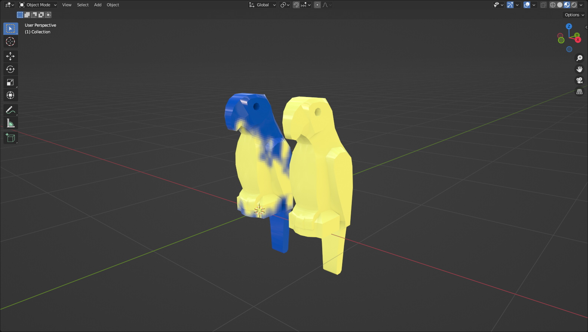
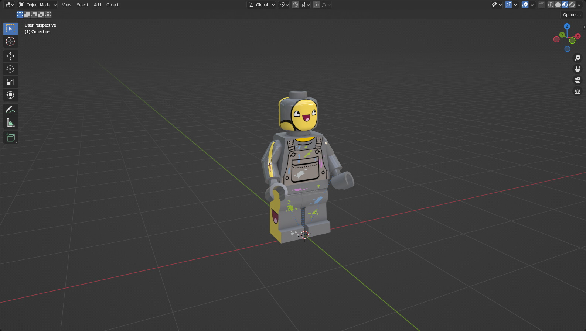
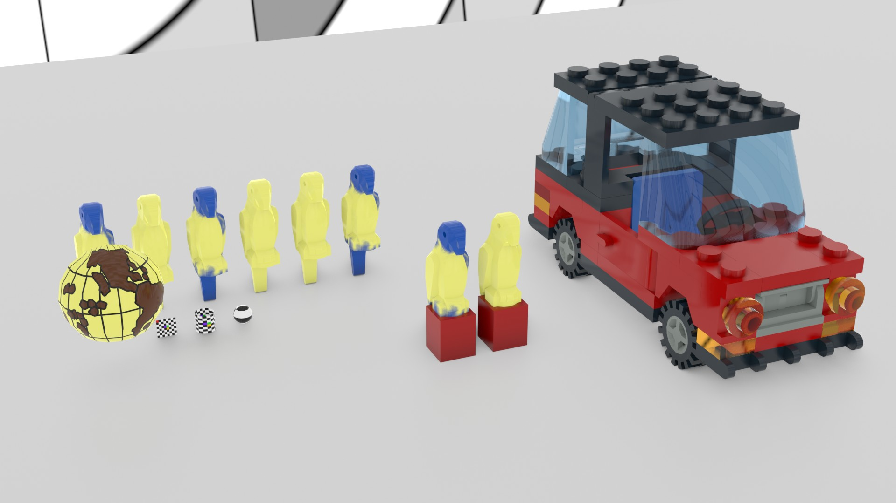

LDraw Handler for Blender 2.82+ and 3.0+, written by 
Matthew Morrison [cuddlyogre] - cuddlyogre@gmail.com - www.cuddlyogre.com

##### Pull requests and examples of this plugin in action are welcome.

I essentially learned Python by dissecting and studying https://github.com/TobyLobster/ImportLDraw, and it inspired me 
to make my own. This plugin wouldn't exist without that one.

I built this plugin with performance and compatibility in mind.

https://omr.ldraw.org/files/337 loads in about 13 seconds.  
https://omr.ldraw.org/files/338 has incorrectly written parts - 10252 - 10252_towel.dat is written as a model - and 
MLCad parts that import correctly.

It handles MLCad parts, LDCad projects, ldr, and mpd. It also processes most official META commands. For instance, STEP
will set keyframes so you can watch the model be built. Theoretically, you could build an entire animation in an MPD
file if you did it right. LeoCAD and LDCad groups are supported. LeoCAD cameras are supported as well. If you have
LSynth parts installed, it will import those as well.

BFC meta commands are processed by default. If you set backface culling to be on for materials or the scene, and you 
imported with remove doubles on, some faces may be missing on parts like 3623.dat. This is due to two faces being in the
same place but facing different directions. Merging doubles essentially removes one of those faces. If you want backface
culling to be on, don't remove doubles. For best results, process BFC commands and remove doubles, while keeping 
backface culling off.

Materials were taken almost wholesale from TobyLobster's plugin. I added my own glass material that was taken from a 
BlenderArtists thread, but most of it is unchanged. - https://blenderartists.org/t/realistic-glass-in-eevee/1149937/19

You are able to choose the logo you want to show on studs, or no logo or stud at all.

Importing TEXMAP is fully supported. This includes planar, cylindrical, and spherical. The DATA meta command is
relatively new compared to TEXMAP support, so it's not supported, yet. Thanks to https://github.com/trevorsandy/lpub3d 
for the cylindrical and spherical math. 



**Stud.io**  
Stud.io parts can be used if you set the LDraw path value to the Stud.io ldraw folder location. On Windows, that should
be **C:\Program Files\Studio 2.0\ldraw**

Stud.io decals are mostly supported. There are some aspects of the spec I have to figure out still, but the current 
level of support should be sufficient for most things. In this example, the textures on the hands are missing. This is 
due to a more challenging part of the wholly undocumented pe_tex spec that Stud.io uses not yet being implemented.  

**Part with decal in PartDesigner**


**The same part imported into Blender**


**A note about Stud.io projects**  
Stud.io project files are in actuality just password-protected zip files, but due to regulations related to DRM, 
importing Stud.io projects will not ever be implemented here, even though it would be relatively trivial. 


Eevee and Cycles are both supported.  

**EEvee**  


**Cycles**  


Sloped parts also have a slope texture applied to them. I have done my best to ensure that all parts in the list are
supposed to be textured and that the angles are correct. The slope angles can be adjusted in the object's material 
settings.


The ability to replace selected parts with different resolution parts is on my TODO list. For instances, 338 from
earlier has a lot of gaps in the tires and fender because the model is built with parts with different resolutions.

Names of parts and mesh data are uuid strings due to a 64 character string limit for names of items in Blender. This is
not ideal, but the LDraw filename is stored in the ldraw_filename custom property of the object/mesh.

### Notes

LDUs in BUs mean that LDraw scaling makes LDraw objects very large in the Blender viewport.

https://www.ldraw.org/article/218.html  
```
LDraw parts are measured in LDraw Units (LDU)  
1 brick width/depth = 20 LDU  
1 brick height = 24 LDU  
1 plate height = 8 LDU  
1 stud diameter = 12 LDU  
1 stud height = 4 LDU

Real World Approximations  
1 LDU = 1/64 in  
1 LDU = 0.4 mm
```
Items might be cut off because the far view plane is not far enough away. To solve that, go to the view tab in the
viewport and change **End** to 10000m.

# Importing

__File > Import > LDraw (.mpd/.ldr/.l3b/.dat)__

**config/import_options.json** Your import settings are saved here every time you import. If you run across any errors, 
delete config/import_options.json from the plugin folder. The defaults are saved and used immediately.

**LDraw filepath:** The path to your LDraw folder. On Windows, the plugins searches the roots of A:-Z:
for an LDraw folder (C:\ldraw). On Linux, it searches the home folder for an ldraw folder (~/ldraw). I don't have a Mac
to test on, so on Mac OS, this value will be blank.

**Import Options**

**Use alternate colors:** Uses LDCfgalt.ldr for more accurate colors.  
**Part resolution:** The quality of parts to use. Low resolution is quicker to import, but doesn't look as good. High
resolution looks better but take longer to import.  
**Display logo:** Display the logo on the stud.  
**Chosen logo:** Which logo to display. logo and logo2 aren't used and are only included for completeness.  
**Profile:** Runs cProfile during import. Saves **export_ldraw_import.prof** to the user's home folder. This file can be
viewed with **snakeviz**.

**Scaling Options**

**Import scale:** What scale to import at. Full scale is 1.0 and is so huge that it is unwieldy in the viewport.  
**Parent to empty:** Parent the imported model to an empty to make it easier to manipulate.  
**Make gaps:** Make small gaps between bricks. A small gap is more realistic.  
**Gap scale:** Scale individual parts by this much to create the gap.  
**Gap target:** Whether to scale the object data or mesh data.  
**Gap strategy:** If object then the gap is applied to the object directly. If constraint, an empty named gap_scale can
be scaled to adjust to gaps between parts.

**Cleanup Options**

**Remove doubles:** Merge vertices that are within a certain distance.  
**Merge distance:** How close the vertices have to be to merge them.  
**Smooth type:** Use either autosmooth or an edge split modifier to smooth part faces.  
**Shade smooth:**  Use flat or smooth shading for part faces.  
**Recalculate normals:** Recalculate normals during import to ensure all normals face outside. Completely overwrites any 
BFC processing. It is recommended to keep unchecked if processing BFC commands is checked

**Meta Commands** - Process LDraw META commands.

**BFC:** Process BFC commands.  
**GROUP:** Imports LeoCAD and LDCad groups.  
**PRINT/WRITE:** Prints PRINT/WRITE META commands to the system console.  
**STEP:** Adds a keyframe that shows the part at the moment in the timeline.  
**Frames per step:** How many frames to put between keyframes.  
**Set step end frame:** Set the final STEP keyframe.  
**CLEAR:** Hides all parts at before this point of the timeline.  
**SAVE:** Doesn't do anything.  
**Set timeline markers:** Add markers to the timeline where META commands were encountered.

**Extras**

**Import all materials:** Import all LDraw materials, not just the ones used by the model.  
**Add subsurface:** Attach a subsurface shader node to materials.  
**Debug text:** Render debug text to the system console.  
**Import edges:** Import LDraw edges as edges.  
**Treat shortcut parts as models:** Treat shortcut parts as if they were models by splitting them into their constituent
parts instead of merging them.  
**Freestyle edges:** Render LDraw edges using freestyle.  
**Prefer unofficial parts:** If a part is in both the unofficial and official library, use the unofficial one.  
**No studs:** Don't import studs. Not particularly useful but is neat to see.  

# Exporting

Exporting a part properly requires a bit of setup, but once that's taken care of it works well. Exported faces are
sorted by color code then by line type.

I have a few parts in the official parts library that were created in Blender and exported using this plugin.

You are able to export parts and models with the correct project setup. You can even build entire models in Blender, but
the workflow needs to be figured out for that to be any kind of fun.

If you're building a part from absolute scratch, model it like you normally would.

Strictly speaking, you don't _need_ to import anything, and could just use empties in their place with the proper
transforms but that is hard to work with. To make things easier to visualize, if you are building with subparts import
those subparts as needed and apply rotation and clear scale. If you don't, subparts will be exported with an
unpredictable rotation and scale.

### Custom Properties

**ldraw_filename**  
When exporting, the exporter will look for a text with this name. It will use this text as a basis to build the part
file from. Otherwise, it will just export the lines as is without the header information.

When exporting subfiles, this is the file name that is at the end of line type 1 lines.

**ldraw_export_polygons**  
Defaults to false if missing or invalid. ldraw_filename required if false, or nothing will be exported.

Specifies whether the object will be exported as polygons or line type 1 lines.

**ldraw_color_code**  
Defaults to 16 if missing or invalid.

Added to subpart objects to specify what color code should be assigned to them.

For exported polygons, add this to any materials that are used in your mesh. The LDraw colors of this code won't
necessarily match the color you'll see in the viewport, so you'll probably want to adjust the diffuse color to something
similar to prevent confusion.

**ldraw_export_precision**  
Defaults to 2 if missing or invalid.

This is used to round the decimal places that objects and polygon vertices are rounded to. 2 is more than sufficient for
most applications, but should you need more, use this value. To prevent unexpected results make sure you place your
vertices in such a way that there are only 2 decimal places when modeling.

### Export Panel

__File > Export > LDraw (.mpd/.ldr/.l3b/.dat)__

**LDraw filepath:**  Used for validating color codes.

**Export Options**

**Selection only:** Only export selected objects.  
**Use alternate colors:** Same as above. Used for validating color codes.  
**Export precision:** How many vertex position decimal points to keep. 2 is sufficient for almost everything.

**Cleanup Options**

**Remove doubles:** Same as above. Helps minimize file size.  
**Merge distance:** Same as above.  
**Recalculate normals:** Use Blender to determine face winding instead of having to deal with BFC.  
**Triangulate mesh:** Triangulate the mesh. Turns quads and ngons into tris.  
**Ngon handling:** If there is an ngon, what to do with it. Skip ignores any ngons. Triangulate splits them into
triangles.

### Development

If you want to make changes to the plugin, this will help  
```pip install fake-bpy-module-2.82```  
```pip install fake-bpy-module-2.93```  
```pip install fake-bpy-module-3.0```  
More information here: https://github.com/nutti/fake-bpy-module
